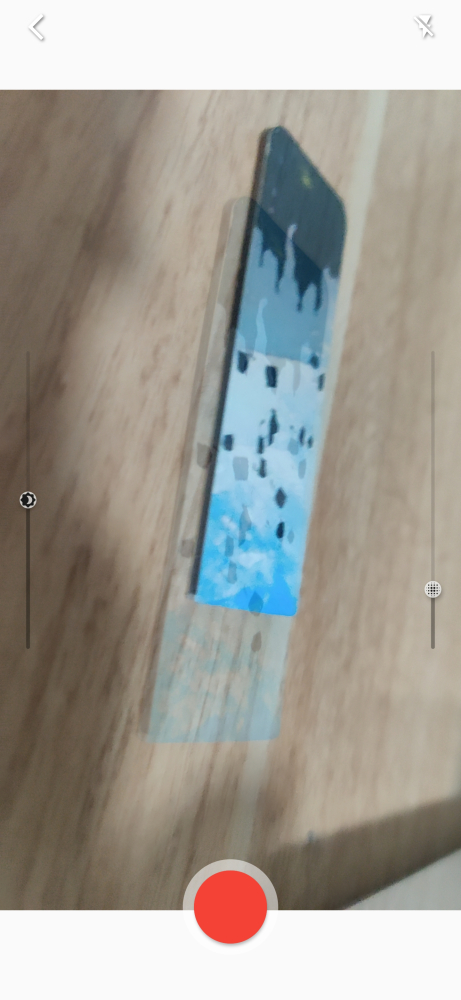
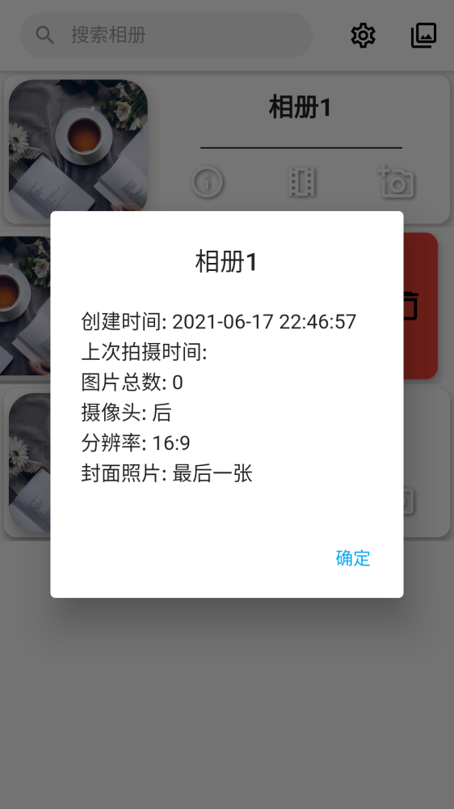
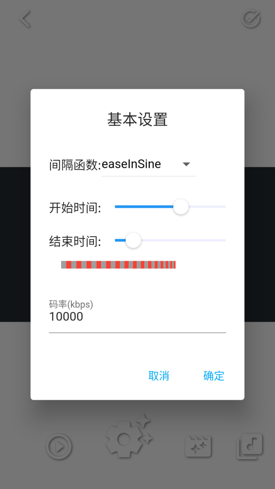
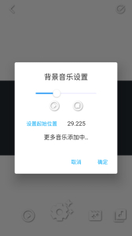

# lanke

想拍摄同一地点不同时间变化的照片，苦于无法对比以前拍摄的样子，于是想开发这样一个拍摄时能便捷对比两照片的APP(找了很久，貌似没有APP有这样的功能)，当然也可以拿来拍简单定格动画等。

功能就很简单了，相册管理、拍照、导出视频，有兴趣请下载体验

## 软件截图

## 关于软件

Android 7.0 及以上，在Android 10的一加手机上成功运行，其它机型未测试(7.1的安卓虚拟机上导出视频闪退，暂时未找到原因)。

因为是跨平台框架开发，开发时也注重了兼容性，按道理也可编译IOS版本，不过苹果开发者账号太贵了，所以暂时就没有编译苹果版本以及上架apple store计划

因为第一次接触flutter框架，代码写的太烂了，等把代码重构之后再开源。

## TODO

辅助：
- [ ] 地理位置
- [ ] 户外光照计算
- [ ] 水平仪
- [ ] 指南针

加强：
- [ ] 更好的拍照界面
- [ ] 更好的照片查看界面
- [ ] 更多的视频滤镜
- [ ] 更多的切换效果
- [ ] 更多的无版权音乐

功能:
- [ ] 导出/导入
- [ ] 相册设置
- [ ] 导出后的观看和分享界面
- [ ] 字幕

开源: 
- [ ] 重构代码
- [ ] 开源

可能不会有的功能：

- [ ] 图片直方图
- [ ] 手动对焦
- [ ] 快门速度
- [ ] ISO
- [ ] 光圈大小
- [ ] 本地音乐
- [ ] 实时预览滤镜

## 关于授权

软件所使用第三方库均为开源授权，使用的图片以及音乐素材均可用于商业以及非商业用途

---

名字(lanke)来源：信安郡石室山，晋时王质伐木至，见童子数人棋而歌，质因听之。童子以一物与质，如枣核，质含之而不觉饥。俄顷，童子谓曰："何不去？"质起视，斧柯尽烂。既归，无复时人。---《烂柯人》